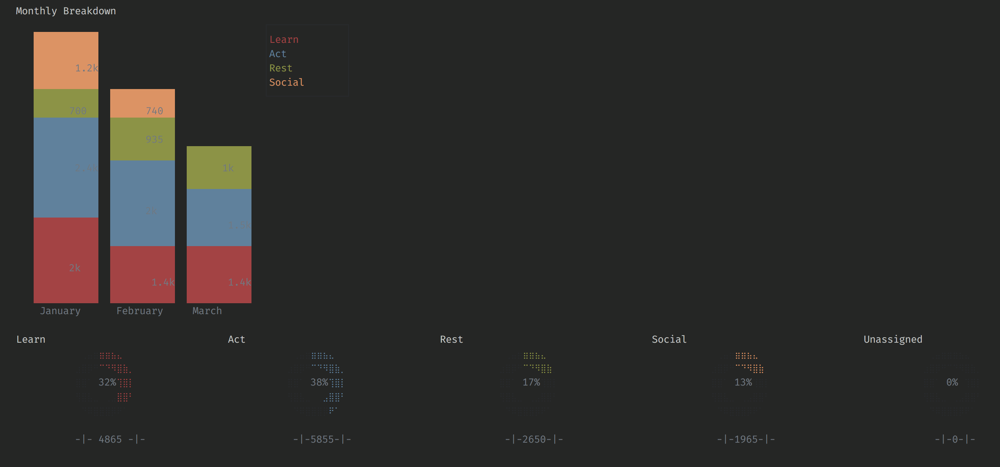

# ándaga - a personal time tracker


At the beginning of 2018 I set out to track all my free time for a year. I was curious about what I could find out about myself via trends in how I spent my time each month. I had also been wanting to build a command line app in node, so this turned out to be a good opportunity to do just that. There was a slight hiatus in August since I moved to a new country for a new job. This project heavily relies on the [Commander](https://github.com/tj/commander.js) and the [Blessed](https://github.com/chjj/blessed) libraries.

 ```
❯ andaga

 -|-|-|-|-|-  log and ándaga will remember  -|-|-|-|-|-
 |-|-|-|-|-  ask me to list and I will show  -|-|-|-|-|
 -|-|-|-  ask me to tell and I will do the math  |-|-|-
 |-|-|-|-  ask for help and it will be given  |-|-|-|-|
```

ándaga has 6 main commands

1) `andaga log` used for logging new entries
2) `andaga list` for listing your entries
3) `andaga tell` for telling you totals
4) `andaga populate` for populating your SQLite database from a json file
5) `andaga backup` backs up your database to a backup json file
6) `andaga show` to bring up a dashboard with statistics on your entries

You can bring up a help menu with `andaga --help` or `andaga -h`
```
❯ andaga -h

  Usage: andaga [options] [command]


  Options:

    -V, --version  output the version number
    -h, --help     output usage information


  Commands:

    log [options] <entry> <time>      logs your entries
    list [options] <amount> [number]  lists your entries
    tell [options]                    tells you stats on your entries
    populate                          runs through the json and populates the db
    backup                            backs up your json file
    show                              dashboard time
```

You can also call help on each of those commands to show further details and options for each. For example, `andaga log -h` would bring up the below options signifying the usage with optional options and required entry and time arguments.
```
❯ andaga log -h

  Usage: log [options] <entry> <time>

  logs your entries


  Options:

    -l | --learn          signifies learning
    -a | --act            signifies action
    -r | --rest           signifies rest
    -s | --social         signifies social
    -d | --date <date>    specifies the date if it was not today
    -p | --place <place>  location activity was done
    -h, --help            output usage information
```

The options are obviously just the options I chose, but I felt that the majority of my activities that I had 100% control over (which is the time I'm logging) was able to fit into the following categories: learn, action, rest, and social. I also track the place and time of each activity.

The goal is to eventually replace this project with the [ándaga-core](https://github.com/ckipp01/andaga-core) engine which will store, server, and provide analysis on all things tracked/logged. Some of the analysis will be done by [waka-machine](https://github.com/ckipp01/waka-machine) which is a machine learning project build in node to provide predictions about my habits and records. This will all be part of the [chronica](https://github.com/ckipp01/chronica) ecoystem.
